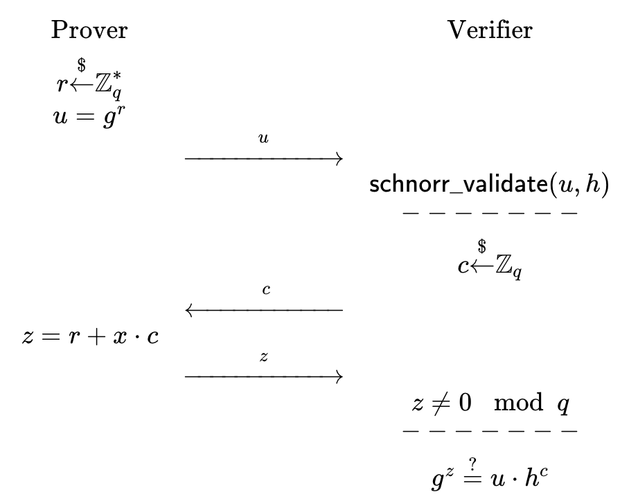

# Schnorr's Identification Protocol
Schnorr's Identification Protocol represented in this repo via \[Sch91\] is a simple zero-knowledge protocol wherein a prover $P$ can convince a verifier $V$ that they know of some private value $x$ under $G$ (where discrete-log problem is hard), against a securely held value $h=g^x$ (where $g$ is a generator of $G$) at $V$ without revealing $x$ itself.

In the interactive format, the protocol runs as follows:

Here, generation of $u$ is necessary to maintain secrecy of x (the additive blinding factor). As without the value $r$, $z = x c$, and $x$ can be retrieved by operation $x = z c^{-1}$ where $c^{-1}$ is the inverse of element $c$ in the group.

## References
- https://crypto.stanford.edu/cs355/19sp/lec5.pdf
- https://crypto.stackexchange.com/questions/58954/multiplication-of-two-points-belong-to-elliptic-curve
